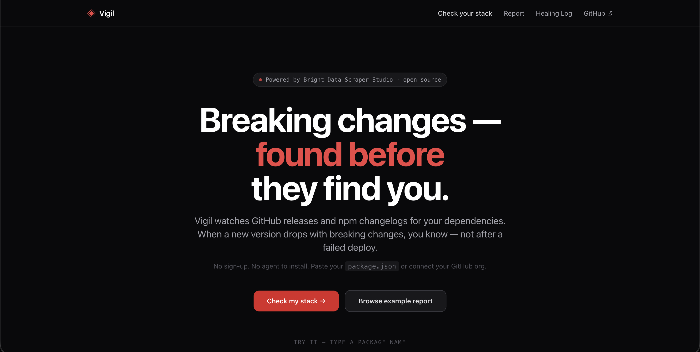
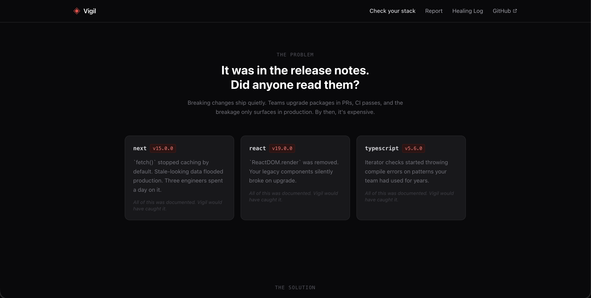
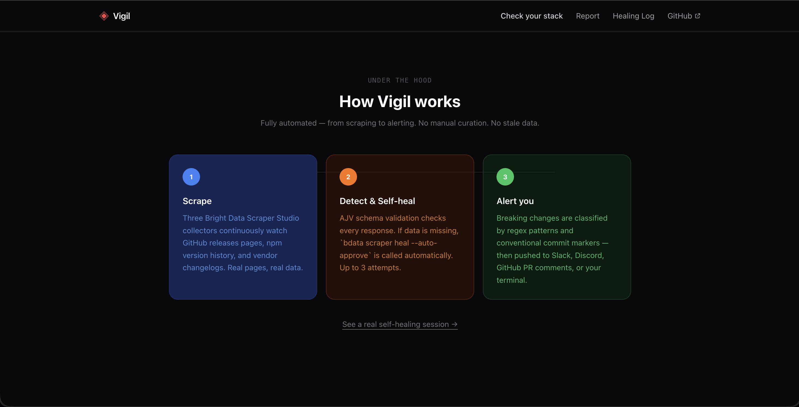
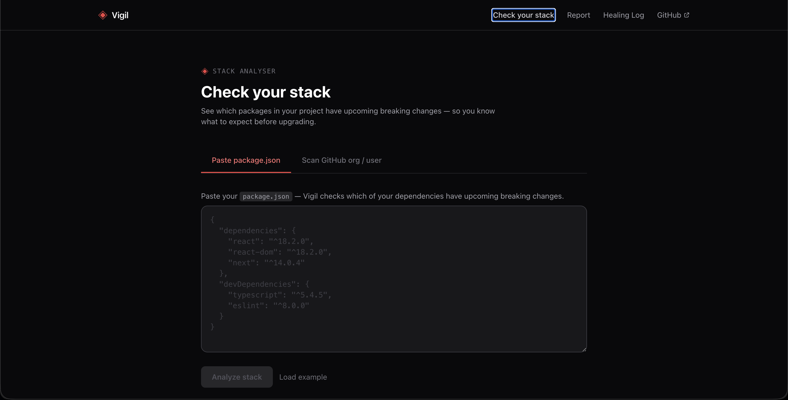
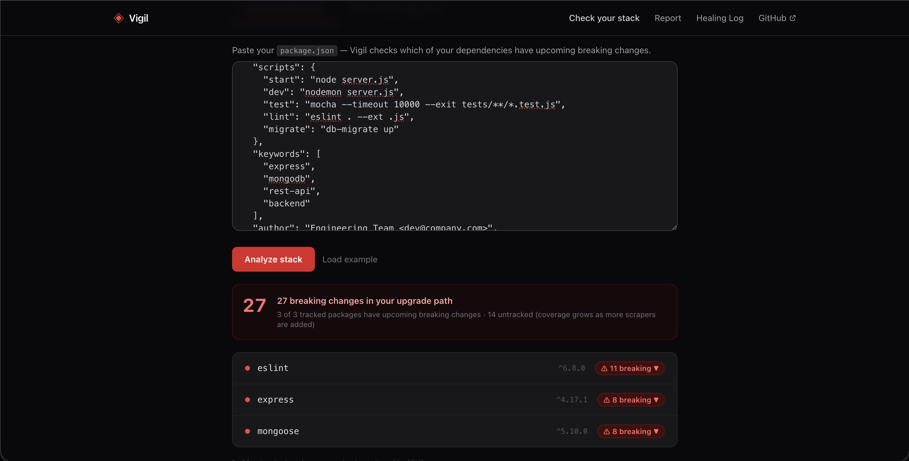
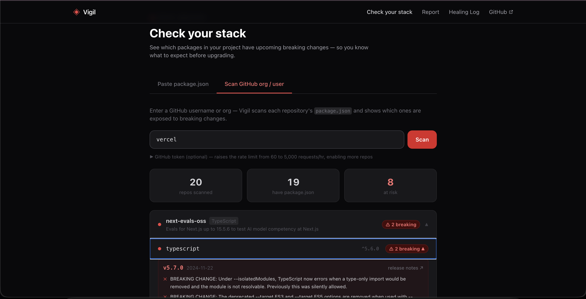
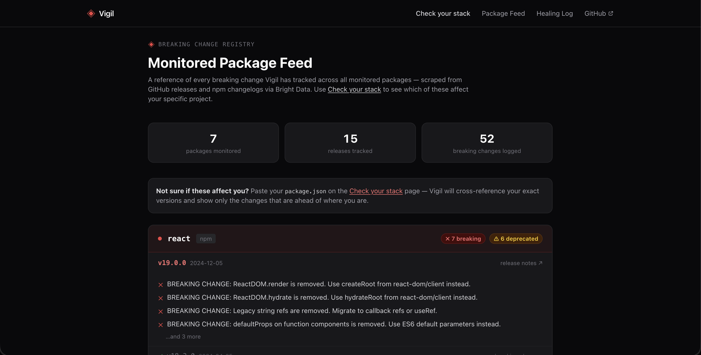
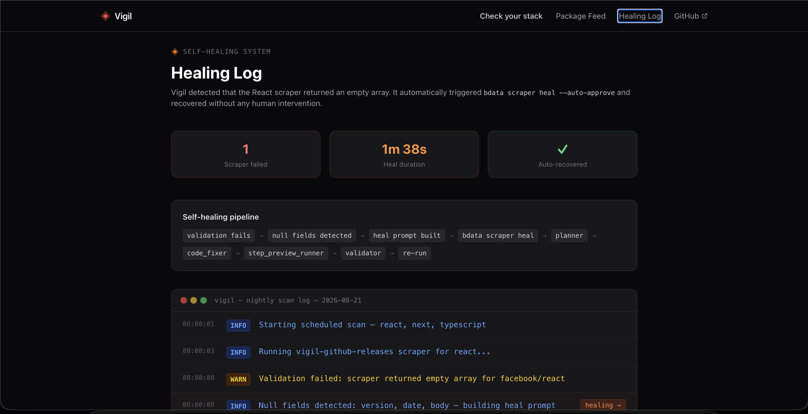
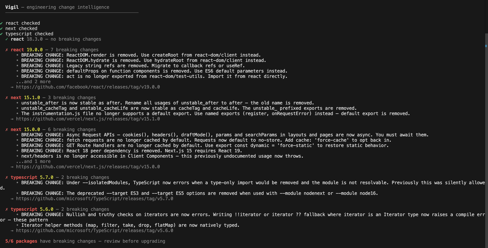

# Vigil

**Self-healing engineering change intelligence** — know about breaking changes in your stack before they hit production.

> Built for the [WeMakeDevs Into the Scrape-Verse hackathon](https://www.wemakedevs.org/hackathons/scrape-verse) using [Bright Data Scraper Studio](https://brightdata.com/products/scraper-studio).

**[vigil-psi-liart.vercel.app](https://vigil-psi-liart.vercel.app)** — live dashboard, no install required

---



---

## The Problem

Engineering teams run on a stack of 10–20 tools. When Next.js drops a breaking change, React removes an API, or TypeScript tightens its type-checker — teams find out in production, not before deploying.

- `npm audit` catches security CVEs
- Dependabot opens PRs for version bumps
- **Nobody tells you *what specifically* will break and *why***

Vigil does that — and when the source sites change their layout and the scraper breaks, it heals itself and keeps watching.

---

## Dashboard

A Next.js web app that lets any developer check their stack without installing anything.





### Check your stack

Paste a `package.json` or connect a GitHub org — see exactly which packages have breaking changes in your upgrade path.







### Breaking change registry

A reference feed of every breaking change Vigil has tracked across all monitored packages.



### Self-healing log

A timeline of the automated healing session — from scraper failure to recovery, with no human intervention.



---

## CLI Demo

```bash
$ node dist/index.js check react next typescript --demo
```



```
  Vigil — engineering change intelligence
  ──────────────────────────────────────────────────

  ✓ react 18.3.0 — no breaking changes

  ✗ react 19.0.0 — 7 breaking changes
      • ReactDOM.render removed — use createRoot instead
      • ReactDOM.hydrate removed — use hydrateRoot instead
      • Legacy string refs removed — migrate to useRef
      …and 4 more
    → https://github.com/facebook/react/releases/tag/v19.0.0

  ✗ next 15.0.0 — 6 breaking changes
      • cookies(), headers(), draftMode() are now async
      • fetch() no longer cached by default
      • Requires React 19 — check peer deps first
      …and 3 more
    → https://github.com/vercel/next.js/releases/tag/v15.0.0

  ⚠ typescript 5.6.0 — 1 breaking change
      • Iterator checks now error on non-iterable types

  5/6 releases checked · 14 breaking changes · review before upgrading
```

---

## How It Works

### 1. Three Bright Data Scrapers

Vigil uses three custom scrapers built with [Bright Data Scraper Studio](https://brightdata.com/products/scraper-studio):

| Scraper | Target | Collector ID |
|---------|--------|-------------|
| `vigil-github-releases` | GitHub `/releases` pages | `c_mt38dv2i1d2xga6atq` |
| `vigil-npm-releases` | npm version history | `c_mt38jj1t11smj3ek9e` |
| `vigil-vendor-changelog` | Vendor changelog pages | `c_mt38q9ng1pxd02lyaf` |

### 2. Self-Healing Loop

When a site changes its layout and the scraper returns null fields or an empty array, Vigil automatically heals:

```
Run scraper → Validate output (AJV + null field detection)
    ↓ fails
Build targeted heal prompt from null fields
    ↓
bdata scraper heal --auto-approve
    ↓
Re-run + re-validate → Log result to SQLite
    ↓ still failing after 3 attempts
Mark scraper degraded → Alert user
```

### 3. Breaking Change Classification

Deterministic regex pattern matching — no LLM API key required:

- `BREAKING CHANGE:` keyword (conventional commits)
- Conventional commit `!` notation (`feat!:`, `fix!:`)
- Section headers (`## Breaking Changes`, `## Migration Guide`)
- Warning emojis (`⚠️`, `💥`)
- Removal/deprecation language

---

## Installation

```bash
git clone https://github.com/Tusharkshahi/vigil.git
cd vigil
npm install
cp .env.example .env
# Fill in BRIGHTDATA_API_KEY and Collector IDs in .env
npm run build
```

**Prerequisites:** Node.js 18+, a [Bright Data account](https://brightdata.com) (free tier)

```bash
# Authenticate with Bright Data CLI
npx -p @brightdata/cli bdata login
```

### Run the dashboard

```bash
cd web
npm install
npm run dev
# Open http://localhost:3000
```

---

## Usage

### CLI

```bash
# Check specific packages (last 30 days)
node dist/index.js check react next typescript

# Run in demo mode (pre-captured data, no API key needed)
node dist/index.js check react next typescript --demo

# Check last 7 days only
node dist/index.js check react next --days 7

# Export JSON report
node dist/index.js check react next --json --output report.json

# Audit scraper health and trigger healing
node dist/index.js doctor
node dist/index.js doctor --heal

# Subscribe for Slack/Discord alerts
node dist/index.js subscribe add react next typescript
node dist/index.js subscribe set-slack https://hooks.slack.com/...
node dist/index.js subscribe set-discord https://discord.com/api/webhooks/...
```

Or install globally to use the `vigil` command:

```bash
npm link
vigil check react next typescript --demo
```

### GitHub Action

Add to your repo to get PR annotations when breaking changes are detected:

```yaml
# .github/workflows/vigil-check.yml
- name: Check for breaking changes
  uses: Tusharkshahi/vigil@main
  env:
    BRIGHTDATA_API_KEY: ${{ secrets.BRIGHTDATA_API_KEY }}
    GH_RELEASES_COLLECTOR_ID: ${{ secrets.GH_RELEASES_COLLECTOR_ID }}
    NPM_RELEASES_COLLECTOR_ID: ${{ secrets.NPM_RELEASES_COLLECTOR_ID }}
    VENDOR_CHANGELOG_COLLECTOR_ID: ${{ secrets.VENDOR_CHANGELOG_COLLECTOR_ID }}
```

---

## Packages Monitored

| Package | Breaking release | Key changes |
|---------|-----------------|-------------|
| `react` | 19.0.0 | ReactDOM.render removed, legacy refs removed, act moved |
| `next` | 15.0.0, 15.1.0 | Async APIs, fetch caching, requires React 19 |
| `typescript` | 5.6.0, 5.7.0 | Iterator checks, isolatedModules stricter, ES3/ES5 targets removed |
| `express` | 5.0.0 | path-to-regexp v8, async errors auto-forwarded, req.param() removed |
| `eslint` | 9.0.0 | Flat config required, --ext removed, context API changes |
| `mongoose` | 8.0.0 | Callbacks removed (promises only), strictQuery default changed |
| `jest` | 29.0.0 | jsdom no longer default testEnvironment, legacy fakeTimers removed |

---

## Environment Variables

| Variable | Required | Description |
|----------|----------|-------------|
| `BRIGHTDATA_API_KEY` | Yes | From `bdata login` or Bright Data dashboard |
| `GH_RELEASES_COLLECTOR_ID` | Yes | `c_mt38dv2i1d2xga6atq` |
| `NPM_RELEASES_COLLECTOR_ID` | Yes | `c_mt38jj1t11smj3ek9e` |
| `VENDOR_CHANGELOG_COLLECTOR_ID` | Yes | `c_mt38q9ng1pxd02lyaf` |
| `SLACK_WEBHOOK_URL` | Optional | For Slack alerts |
| `DISCORD_WEBHOOK_URL` | Optional | For Discord alerts |

---

## Bright Data Usage

This project uses **Bright Data Scraper Studio** as its core scraping infrastructure:

- All three scrapers were built with `bdata scraper create` — AI-generated from a URL and description
- Scrapers run via `bdata scraper run` on Bright Data's cloud infrastructure
- Self-healing uses `bdata scraper heal --auto-approve` for fully autonomous recovery
- No pre-built Bright Data datasets are used — all three scrapers are custom-built from scratch
- All target data is publicly available (GitHub release pages, npm version listings)

---

## Tech Stack

| Layer | Technology |
|-------|-----------|
| Scraping | Bright Data Scraper Studio |
| CLI orchestration | TypeScript + Node.js + Commander.js |
| Schema validation | AJV |
| Breaking change detection | Regex pattern matching |
| Terminal output | Chalk + ora |
| Storage | SQLite (better-sqlite3) |
| Alerting | Axios (Slack/Discord webhooks) |
| Dashboard | Next.js 14 + Tailwind CSS |
| Deployment | Vercel |

---

## Project Structure

```
vigil/
├── src/
│   ├── commands/       # vigil check, vigil doctor, vigil history
│   ├── scraper/        # Bright Data client + collector IDs
│   ├── healing/        # Self-healing orchestrator (healer.ts)
│   ├── parser/         # Breaking change classifier + diff
│   ├── validation/     # AJV schema + null field detector
│   ├── alerting/       # Slack + Discord webhook senders
│   └── reporter/       # Terminal (chalk) + JSON output
├── demo/fixtures/      # Pre-captured data for --demo mode
├── schemas/            # AJV JSON schemas
├── images/             # Screenshots
├── web/                # Next.js dashboard
│   ├── app/            # Pages: /, /check, /report, /healing
│   └── lib/            # Data layer, GitHub API, semver analysis
└── .github/workflows/  # vigil-check.yml + nightly-scan.yml
```

---

## Hackathon Submission

- **Event**: WeMakeDevs Into the Scrape-Verse (Aug 17–23, 2026)
- **Built with**: Bright Data Scraper Studio CLI
- **AI assistance**: Devin (disclosed per hackathon rules)
- **License**: MIT
